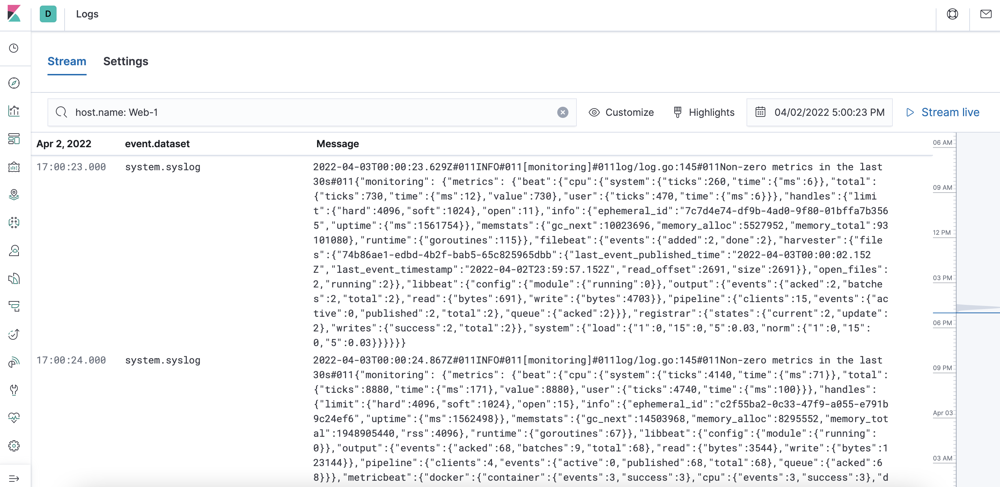
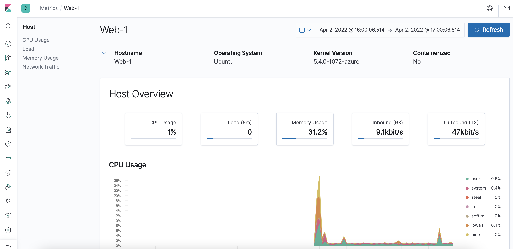

## Automated ELK Stack Deployment

The files in this repository were used to configure the network depicted below.

These files have been tested and used to generate a live ELK deployment on Azure. They can be used to either recreate the entire deployment pictured above. Alternatively, select portions of the elksetup.yml file may be used to install only certain pieces of it, such as Filebeat.

- _[ELK Install](Ansible/elksetup.yml)_
- _[DVWA Install](Ansible/my-playbook.yml)_
- _[Filebeat & Metricbeat Install](Ansible/filebeat-playbook.yml)_

This document contains the following details:
- Description of the Topology
- Access Policies
- ELK Configuration
  - Beats in Use
  - Machines Being Monitored
- How to Use the Ansible Build

### Description of the Topology

The main purpose of this network is to expose a load-balanced and monitored instance of DVWA, the D*mn Vulnerable Web Application.

Load balancing ensures that the application will be highly stable and available, in addition to restricting user access to the network.
- _Load balancers protect the availability of a network by distributing traffic across multiple VMs. The primary advantage of a Jump Box is that it is a secure gateway to the network and restricts unauthorized users from accessing it._

Integrating an ELK server allows users to easily monitor the vulnerable VMs for changes to the logs and system resources.
- FileBeat watches for system logs and allows them to be easily reviewed on the ELK server._
- _Metricbeat is used to record various metrics and usage statistics from the hosts it's deployed on, for review on the ELK server._

The configuration details of each machine may be found below.
_Note: Use the [Markdown Table Generator](http://www.tablesgenerator.com/markdown_tables) to add/remove values from the table_.

| Name     | Function | IP Address | Operating System |
|----------|----------|------------|------------------|
| Jump Box   | Gateway  | 10.0.0.7   | Linux |
| ELK-Server | Elasticsearch Stack | 10.1.0.4 | Linux |
| Web-1      | Web Server | 10.0.0.5 | Linux |
| Web-2      | Web Server | 10.0.0.6 | Linux |

### Access Policies

The machines on the internal network are not exposed to the public Internet. 

Only the Jump Box machine can accept connections from the Internet. Access to this machine is only allowed from the following IP addresses:
- _136.24.124.197_

Machines within the network can only be accessed by the Jump Box.
- _10.0.0.7_

A summary of the access policies in place can be found in the table below.

| Name     | Publicly Accessible | Allowed IP Addresses |
|----------|---------------------|----------------------|
| Jump Box | Yes, via SSH only   | 136.24.124.197:22    |
| Web-1 & Web-2 |    No          |     10.0.0.7:22      |
| ELK-Server    |     No         |     10.0.0.0/16      |

### Elk Configuration

Ansible was used to automate configuration of the ELK machine. No configuration was performed manually, which is advantageous because...
- _Ansible allows users to reuse previous deployments on multiple servers, update their playbooks as needed, and reduces the chance of human error_

The playbook implements the following tasks:
- _Installs Docker to the server_
- _Installs Python3-pip to allow for more efficient Docker module installations_
- _Installs the Docker module via Python_
- _Increases virtual memory of the server to increase stability_
- _Downloads and launches the Docker ELK container on the server_

The following screenshot displays the result of running `docker ps` after successfully configuring the ELK instance.

### Target Machines & Beats
This ELK server is configured to monitor the following machines:
- _10.0.0.5_
- _10.0.0.6_

We have installed the following Beats on these machines:
- _Filebeat and Metricbeat were isntalled on Web-1 & Web-2_

These Beats allow us to collect the following information from each machine:
- _Filebeat collects various logs from the two Web VMs, including the system.syslog_

- _Metricbeat, by contrast, allows for visualization of various logs such as:

### Using the Playbook
In order to use the playbook, you will need to have an Ansible control node already configured. Assuming you have such a control node provisioned: 

SSH into the control node and follow the steps below:
- Copy the elksetup.yml file to ~/etc/ansible/
- Update the hosts file to include the ELK server's IP address as a separate attribute
- Run the playbook, and navigate to http://{ELK_Server_Public_IP}:5601/app/kibana to check that the installation worked as expected.

- The elksetup.yml file is the playbook and should be copied to the Ansible directory on the ELK server._
- _The hosts file is updated to run the playbook on the ELk server since it's listed under a separate attribute than the Web servers, where Filebeat is installed.
- _The URL above should load properly and display the Kibana landing page if everything was installed correctly._
